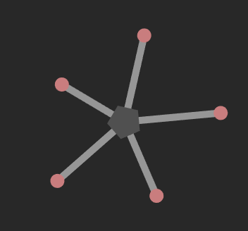

# Superlinear Angular Momentum in Reaction Wheels

This is my final project for PHYS 350 at UBC, wherein I develop several mathematical
models of expanding reaciton wheels. It is written in the context of robot control systems,
however the primary focus is on the lagrangian formalism used to describe such a system.

## Installation

TODO: Write installation instructions here

## Usage

To run the simulation, you must first install SFML, the Crystal compiler, and
`shards` (the Crystal) package manager. In the project directory, run `shards
install` to install dependencies, then run `crystal run src/reaction-wheel.cr`
to launch the visualizer. Graphing is done with `Ishi`, which requires `gnuplot`
to be installed on your system.
